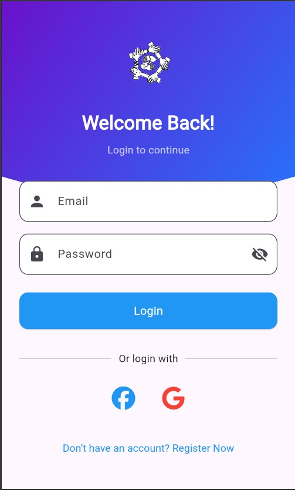
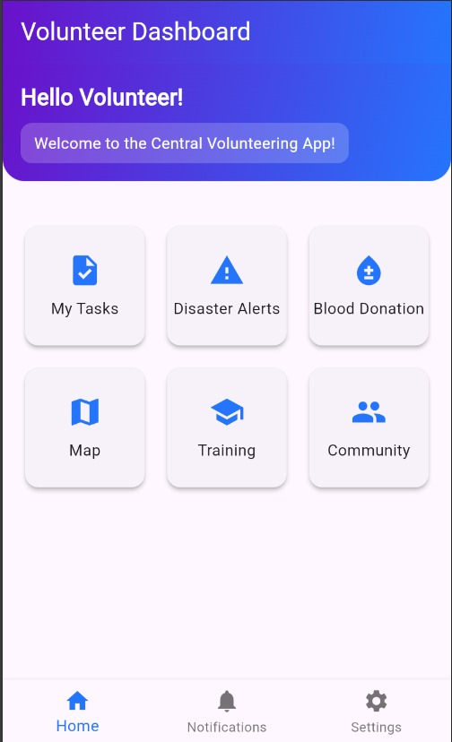
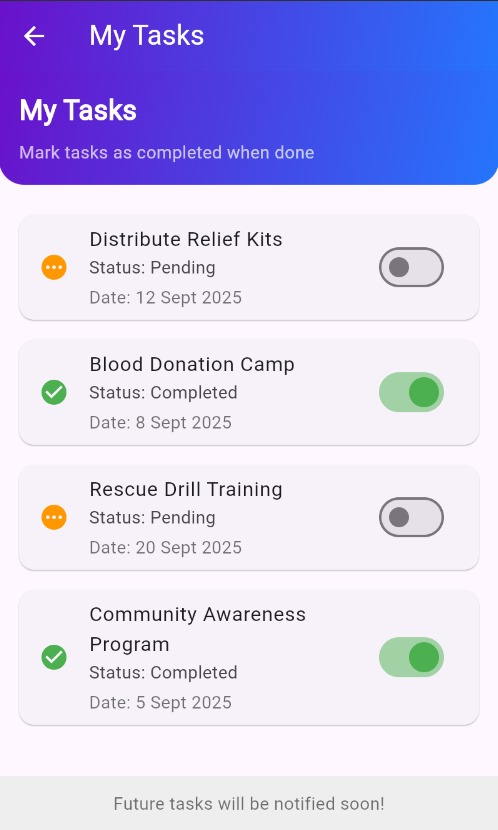
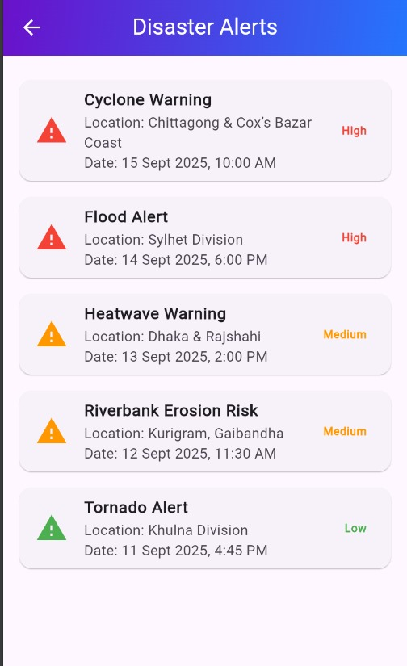
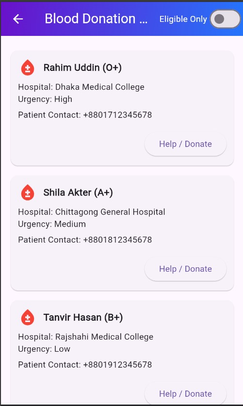
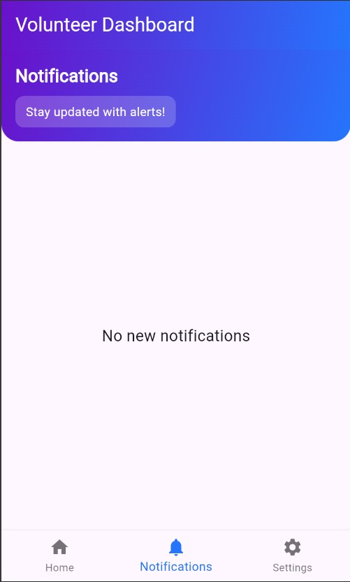
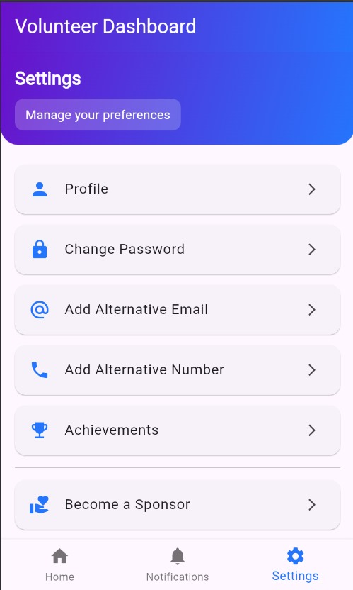
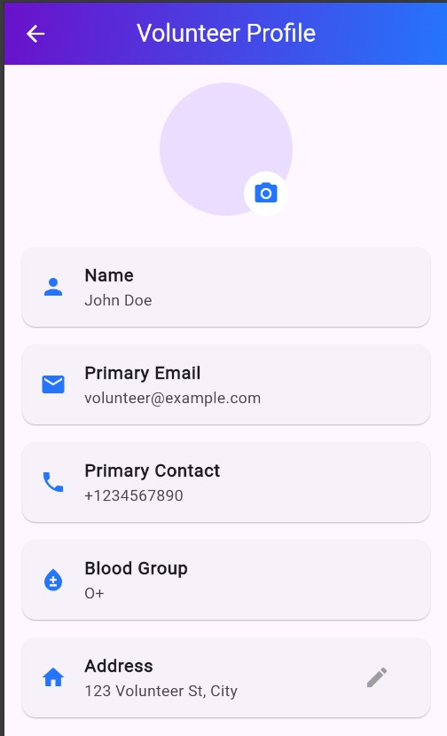

# ResQNet 🚑

ResQNet is a Flutter-based mobile application designed to provide a **centralized volunteering and disaster management platform**.  
It connects **volunteers, sponsors, and communities** to coordinate relief efforts efficiently in times of need.
(The project is still developing and it is a prototype version of the app.)
---

## ✨ Features

### Volunteer Features
- 📋 **Task Management** – View and manage assigned volunteering tasks.  
- 🚨 **Disaster Alerts** – Get real-time updates on disaster situations.  
- 🩸 **Blood Donation** – Request and donate blood with built-in eligibility filtering by blood group.  
- 🗺 **Map View** – Track disaster locations and rescuers on an interactive map.  

### Sponsor Features
- 💰 **Donations** – Contribute money, medicine, or supplies directly through the app.  


### General Features
- 🔐 **Login System** (Volunteer & Sponsor roles).  
- 🧑‍🤝‍🧑 **Profile Management** with alternative contacts. 
- 👥 **Community Support** – Help organize and fund volunteering activities.   
- 🏆 **Achievements** for recognition of contributions.  
- 🎨 Modern **UI/UX with gradient themes**.  

---

## 📱 Screenshots








---

## 🚀 Getting Started

### Prerequisites
- Flutter SDK (>=3.0.0 <4.0.0)  
- Android Studio / VS Code with Flutter extension  
- Firebase account (if using Firebase Auth & Firestore)  

### Installation

1. Clone this repository:
   ```bash
   [git clone https://github.com/your-username/ResQNet.git](https://github.com/Tusher44/ResQNet.git)
   cd ResQNet
